# nuedc2025-c-generator

2025年全国大学生电子设计竞赛C题，基于单目视觉的目标物测量装置，标准化测试图案生成器。

生成A4尺寸（210×297mm）的SVG/PDF测试图案，以及YOLO数字识别训练数据集。

> 赛题要求参赛队自制目标物用于系统调试。本工具按赛题规格自动生成各类目标物图案，省去手工制作的麻烦。
>
> 2025电赛C题国一。

## 示例

### 基本目标物

| 圆形 (100mm) | 三角形 (120mm) | 正方形 (140mm) |
|:------------:|:--------------:|:--------------:|
| 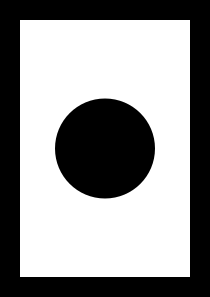 | 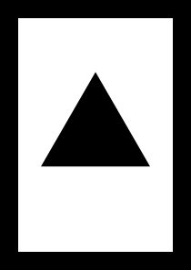 | 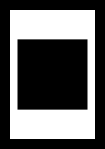 |

### C题标准发挥目标物

| type1 单个正方形 | type2 多正方形组合 | type3 带数字编号 | type4 旋转测量 |
|:----------------:|:-----------------:|:---------------:|:--------------:|
| 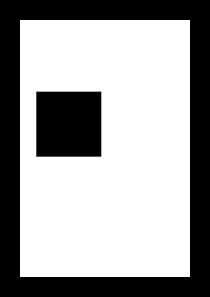 | 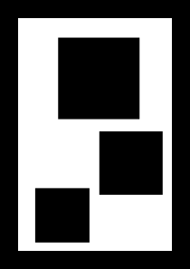 | 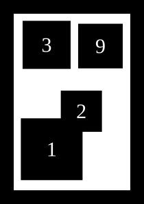 | 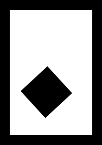 |

### 练习用目标物

| 难度0 简单 | 难度1 中等 | 难度2 困难 |
|:----------:|:----------:|:----------:|
| 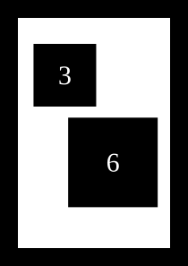 | 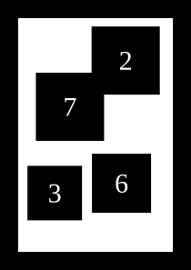 | 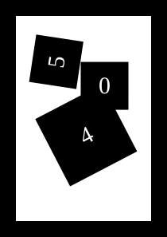 |

### YOLO数字识别数据集

<table>
<tr>
<td align="center">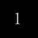<br>64px, -2.7°, 0.8</td>
<td align="center">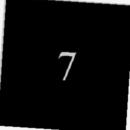<br>256px, -2.4°, 0.1</td>
<td align="center">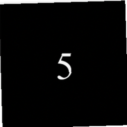<br>256px, 3.3°, 0.2</td>
<td align="center">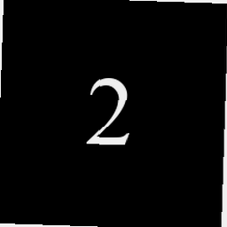<br>256px, 2.8°, 0.3</td>
</tr>
<tr>
<td align="center">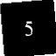<br>64px, -0.7°, 0.7</td>
<td align="center">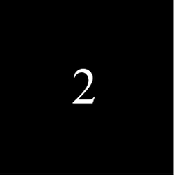<br>256px, 1.8°, 0.1</td>
<td align="center">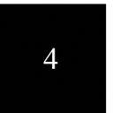<br>128px, -3.5°, 1.0</td>
<td align="center">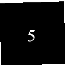<br>128px, 4.8°, 0.7</td>
</tr>
</table>

## 功能

### 基本目标物

白色A4纸中心印制单个黑色实心几何图形，边长/直径 100-160mm：

| 图形 | 尺寸范围 | 数量 |
|------|----------|------|
| 圆形 | 100-160mm，每5mm | 13个 |
| 等边三角形 | 100-160mm，每5mm | 13个 |
| 正方形 | 100-160mm，每5mm | 13个 |

### C题标准发挥目标物（4类）

按C题官方规格生成4类发挥目标物：

| 类型 | 说明 | 正方形 | 数字 | 旋转 | 重叠 |
|------|------|--------|------|------|------|
| type1_single | 单个正方形 | 1个 | 无 | 无 | 无 |
| type2_multi | 多正方形组合 | 2-4个 | 无 | 无 | 允许0或1对局部重叠 |
| type3_digit | 带数字编号 | 3-4个 | 有(0-9) | 无 | 允许0或1对局部重叠 |
| type4_rotated | 旋转测量 | 1个 | 无 | 随机0-360° | 无 |

正方形边长范围：60-120mm（C题要求6-12cm）。

### 练习用目标物（批量生成）

按难度级别批量生成，用于打印后调试算法：

| 难度 | 正方形数量 | 旋转 | 重叠 | 说明 |
|------|-----------|------|------|------|
| 0 简单 | 2-4个 | 无 | 无 | 入门调试 |
| 1 中等 | 3-4个 | 无 | 1对 | 国赛实际难度 |
| 2 困难 | 3-5个 | 随机 | 多对 | 算法压力测试 |

难度1对应国赛实际比赛难度，建议优先使用此难度进行调试。

### 打印指导

使用PDF文件打印，SVG可能被浏览器或阅读器缩放。

| 设置项 | 正确值 | 错误值 |
|--------|--------|--------|
| 页面大小 | A4 | 自动/适合 |
| 缩放 | 实际大小 / 100% | 适合页面 / 缩放以适合 |
| 边距 | 无 / 最小 | 默认 |
| 方向 | 纵向 | 自动 |

打印后用直尺测量黑色边框宽度，应为20mm（2cm）。偏差超过1mm则检查打印设置。

### YOLO数字识别数据集

生成用于YOLO训练的数字识别数据集，模拟CV裁切后的图像。图像为白色背景上的黑色正方形，内含白色数字。支持多尺度裁切（64/128/256px）、模拟CV误差（位置偏移±5px）、光照变化、随机旋转（±5°）、高斯噪声、多字体（Times New Roman、Arial、Consolas），训练集额外应用旋转和噪声增强。

#### 裁切尺寸设计依据

基于竞赛实际场景推算（1080p摄像头，90° FOV，距离100cm到200cm）：

| 距离 D | 画面水平宽度 | A4页(21cm) | 60mm正方形 | 120mm正方形 | 30mm数字 |
|--------|-------------|-----------|-----------|------------|---------|
| 100cm | 200cm | 202px | 58px | 115px | 29px |
| 150cm | 300cm | 134px | 38px | 77px | 19px |
| 200cm | 400cm | 101px | 29px | 58px | 14px |

实际竞赛中数字高度为14到29px。多尺度裁切对应：

| 裁切尺寸 | 正方形像素 | 数字范围 | 覆盖场景 |
|----------|-----------|---------|---------|
| 64px | 51px | 13~26px | 远距离小正方形 (D≈2m, 60mm) |
| 128px | 102px | 26~51px | 中距离 (D≈1.5m) |
| 256px | 205px | 51~102px | 近距离 + 裁切余量 |

## 安装

需要Python ≥ 3.12。

```bash
# 克隆仓库
git clone https://github.com/Sylvan-Cheng/nuedc2025-c-generator.git
cd nuedc2025-c-generator
```

### 使用uv

```bash
uv sync
```

### 使用pip

```bash
pip install -e .
```

### 使用conda

```bash
conda env create -f environment.yml
conda activate nuedc2025
pip install -e .
```

## 使用

### 使用 uv

```bash
uv run nuedc-gen
```

### 使用 pip / conda

```bash
nuedc-gen

# 如果命令不可用
python run.py
```

### 输出目录结构

```
output/
├── basic_targets/          ← 基本目标物（3种图形 × 13个尺寸 = 39个文件）
│   ├── circle/svg/  circle/pdf/
│   ├── triangle/svg/  triangle/pdf/
│   └── square/svg/  square/pdf/
├── c_exam/                 ← C题标准发挥目标物（4类，共18个文件）
│   ├── type1_single/svg/  type1_single/pdf/
│   ├── type2_multi/svg/   type2_multi/pdf/
│   ├── type3_digit/svg/   type3_digit/pdf/
│   └── type4_rotated/svg/ type4_rotated/pdf/
├── svg/  pdf/              ← 练习用目标物（默认500个文件）
└── yolo_dataset/           ← YOLO数字识别数据集
    ├── data.yaml           ← YOLO配置文件
    ├── train/
    │   ├── images/         ← 训练集图片
    │   └── labels/         ← 训练集标注
    ├── val/
    │   ├── images/         ← 验证集图片
    │   └── labels/         ← 验证集标注
    └── test/
        ├── images/         ← 测试集图片
        └── labels/         ← 测试集标注
```

每个SVG文件对应一个同名PDF文件。

## 配置

所有配置在`config.toml`，运行时自动从项目根目录或当前工作目录加载。也可以使用 `python -m nuedc_gen path/to/config.toml` 指定配置文件。

程序每次开始生成前会清空 `global.output_dir` 指定目录下的已有内容，然后重新生成文件。`output_dir` 必须是当前工作目录的子目录，程序会拒绝清空空路径、当前工作目录、用户主目录和磁盘根目录。

### 全局配置

```toml
[global]
output_dir = "output"        # 全局输出目录
```

### 页面设置

```toml
[page]
width_mm = 210              # A4 宽度 (mm)
height_mm = 297             # A4 高度 (mm)
margin_mm = 20              # 纸边距：纸边缘到白色区域内边缘的距离 (mm)，C题要求 2cm
safe_margin_mm = 5          # 白色区域内安全边距 (mm)
```

### 字体配置

```toml
[fonts]
enable_bold = false         # 是否生成加粗字体样本
bold_probability = 0.3      # 加粗概率（enable_bold=true时生效）
enable_multi_font = false   # 是否启用多字体

# 字体权重（enable_multi_font=true时生效，总和应为1.0）
[fonts.weights]
"Times New Roman" = 0.6
Arial = 0.2
Consolas = 0.2
```

### 数据增强配置

```toml
[augment]
enable = true               # 是否启用数据增强
rotation_range = 5.0        # 旋转范围 ±5°
brightness_range = [0.9, 1.1]  # 亮度范围
contrast_range = [0.9, 1.1]    # 对比度范围
noise_std = 0.005           # 高斯噪声标准差
```

数据增强仅作用于YOLO训练集，不影响练习用目标物。

### 基本目标物

```toml
[basic_target]
enable = true               # 是否生成基本目标物
min_size_mm = 100           # 最小边长/直径 (mm)
max_size_mm = 160           # 最大边长/直径 (mm)
step_mm = 5                 # 尺寸间隔 (mm)
```

### 练习用目标物（批量模式）

```toml
[extended_target]
enable = true               # 是否生成练习用目标物
difficulty = 1              # 0=简单, 1=中等(国赛实际难度), 2=困难
total_files = 500           # 生成图片总数

[extended_target.square]
min_size_mm = 60            # 正方形最小边长 (mm)
max_size_mm = 120           # 正方形最大边长 (mm)
gap_mm = 10                 # 不重叠时的最小间距 (mm)
dense_gap_mm = 2            # 难度0生成3-4个正方形时使用的紧凑间距 (mm)

[extended_target.digit]
font_size = 30              # 数字字体大小
overlap_threshold_mm = 40   # 数字中心最小间距 (mm)

[extended_target.overlap]
min_ratio_medium = 0.05     # 难度1有效重叠率下限
max_ratio_medium = 0.20     # 难度1有效重叠率上限
min_ratio_hard = 0.05       # 难度2有效重叠率下限
max_ratio_hard = 0.40       # 难度2有效重叠率上限
```

练习用目标物生成后会执行约束校验，确保满足对应难度要求。

### C题标准模式

```toml
[c_exam]
enable = true               # 是否生成C题标准目标物

[c_exam.type1_single]       # 单个正方形
count = 1
total_files = 3

[c_exam.type2_multi]        # 多正方形组合（允许重叠）
count_min = 2
count_max = 4
total_files = 5

[c_exam.type3_digit]        # 带数字编号（允许重叠）
count_min = 3
count_max = 4
total_files = 5
generate_digits = true

[c_exam.type4_rotated]      # 单个正方形，随机旋转
count = 1
total_files = 5
allow_rotation = true
```

### 数据集导出

```toml
[export]
png_size = 60               # 裁剪 PNG 尺寸 (px)
enable_digit_export = false # 是否生成数字裁剪 PNG

[export.noise]
enable = false              # 是否生成噪声裁剪
count = 4                   # 每张图噪声裁剪数
overlap_threshold = 0.4     # 允许最大正方形重叠比例
crop_size_mm = 50.0         # 裁剪区域边长 (mm)
```

### YOLO数据集导出

生成0-9共10类数字的YOLO格式数据集。每张图为模拟CV裁切后的正方形区域，白色背景上绘制黑色正方形，正中央放置白色数字。每条样本包含归一化的YOLO边界框标注。

```toml
[yolo_export]
enable = true               # 是否生成YOLO数据集
train_ratio = 0.8           # 训练集比例
val_ratio = 0.15            # 验证集比例
test_ratio = 0.05           # 测试集比例（建议三者和为1.0）

[yolo_export.digit]
image_sizes = [64, 128, 256]  # 裁切后图片尺寸列表 (px)
digit_size_ratio_min = 0.25  # 数字占正方形比例下限
digit_size_ratio_max = 0.5   # 数字占正方形比例上限
square_ratio = 0.8           # 正方形占整个图片的比例
cv_noise_level = 5           # 模拟CV裁切时的像素偏移误差
samples_per_digit = 1000     # 每个数字的样本数（总量 = 10 × 此值）
```

数据集总样本数为 `10 × samples_per_digit`，按比例分配到训练集、验证集和测试集。

生成时每个样本随机选择 `image_sizes` 中的一个尺寸，数字大小在 `digit_size_ratio_min` 到 `digit_size_ratio_max` 范围内随机决定。`cv_noise_level` 控制裁切位置误差（像素）。训练集会额外应用 [augment] 中的数据增强。

## License

MIT
